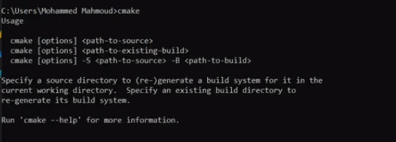

## Presiquite
C++ 11

Cmake installed
### Windows
#### First way
Access https://cmake.org/download/ 

Download prefer installer. For example: **cmake-3.29.2-windows-x86_64.msi** for windows x64. Run installer to install.
Check cmake install with command line in windows 
```bash
cmake
```

#### Second way
```bash
#if using Windows Package Manager
winget install kitware.cmake
#if using Chocolatey
choco install cmake
```
### Linux
```bash
#update package 
sudo apt update && sudo apt upgrade
#install cmake
sudo apt install cmake
#check cmake install
cmake --version
```
## How To Build
Clone this repository. Run following command 
```bash
cmake -S . -B .
#build
cmake --build . -j 12
#running test
ctest -V
```
File __main__ will generate
Running ./main input.txt

## Report Require
- Mô tả dự án
- Mô tả đề tài
- Lý do chọn cách thiết kế code: đặt header vào `include` và phần hiện thực vào `src` và chia các object chính User, Project, Task, Issue thành các file khác nhau để có thể dễ dàng quản lí, thêm bớt các hàm nếu cần. `System.h` và `System.cpp` để có thể thực hiện test. Chia các tính năng chính thành các hàm để thực hiện một cách độc lập không bị ảnh hưởng tới nhau nếu có thay đổi
- Mô tả testcase: Ở dưới có mô tả
- Kết quả chạy: all pass

Sửa lại Đại học bách khoa->trường đại học bách khoa
## Note
Toàn bộ những gì ghi trong yêu cầu đề tài. Ngoài ra nhóm còn có thêm:
### Status
Issue:
- found: status mặc định sau khi vừa tạo
- expired hệ thống tự chuyển đổi bằng cách kiểm tra end_time của task và ngày hiện tại. Nếu ngày hiện tại lớn hơn end_time của task-> chuyển sang expired
- còn lại thủ công, hệ thống không tự động thay đổi

Task 
- initialized: status mặc định sau khi vừa tạo
- late: hệ thống tự chuyển đổi bằng cách kiểm tra end_time của task và ngày hiện tại. Nếu ngày hiện tại lớn hơn  end_time của task-> chuyển sang late
- extended: hệ thống tự chuyển đổi mỗi lần có edit end_time và end_time lớn hơn endtime hiện tại
- done: Thủ công. Chỉ có thể chuyển task sang trạng thái done nếu toàn bộ issue đã resolved. 
- running: hệ thống tự chuyển đổi nếu ngày hiện tại lớn hơn ngày bắt đầu và status là initialized

Project:
- starting: status mặc định sau khi vừa tạo
- running: hệ thống tự chuyển đổi có hành vi tạo task nếu status của project là starting
- late: hệ thống tự chuyển đổi có ít nhất 1 task đang có trạng thái late
- delayed: hệ thống tự chuyển đổi bằng cách kiểm tra end_time của project và ngày hiện tại. Nếu ngày hiện tại lớn hơn  end_time của project-> chuyển sang deplayed
- finished Thủ công. Chỉ thực hiện được nếu tất cả task có status done

### Delete
User: Sau khi xoá user, toàn bộ task, issue, project chứa id của user sẽ xoá id của user ra khỏi danh sách (member, leader)

Issue: Sau khi xoá issue task chứa issue sẽ xoá issue ra khỏi danh sách

Task: Sau khi xoá task project chứa task sẽ xoá task ra khỏi danh sách. Xoá toàn bộ issue thuộc task

Project: Sau khi xoá project, toàn bộ task và issue trong project sẽ bị xoá
### User
Không thể xoá project manager

Trong danh sách --member kiểm tra id là member hay không

Trong danh sách --leader kiểm tra id là leader hay không

Chỉ có thể gán user chứa trong danh sách leader, member của project cho danh sách member của task trong project (gán danh sách member ngoài project cho task trong project thì raise lỗi)

Luôn luôn kiểm tra id của người dùng có nằm trong danh sách người dùng hay không

Kiểm tra id của user có nằm trong project hay không, người ngoài project không được tạo sửa xoá, task, issue (dù là role leader hay manager)

### Date
Kiểm tra tính hợp lệ của date ví dụ ngày 32 hay ngày 30 tháng 2, tháng có giá trị quá 12

Không thể edit, tạo task với ngày end_time của task quá ngày project chứa trong task

Không thể edit, tạo task với ngày start_time của task trước ngày project chứa trong task

### Project
Project manager không thể xoá được project của người khác

## Testcase
Testcase với UnitTest, chỉ kiểm tra những trường hợp không vi phạm. Testcase được viết trong file UnitTest.cpp
- TEST(CreateUser,Subtest_Create_Leader): Tạo user, kiểm tra hàm CreateUser
- TEST(EditUser,Subtest_EditUserName): Chỉnh sửa thông tin user, kiểm tra hàm EditUser
- TEST(DeleteUser,Subtest_DeleteUser): Xoá user, kiểm tra hàm DeleteUser
- TEST(CreateProject,Subtest_4): Tạo project, kiểm tra hàm CreateProject
- TEST(EditProject,Subtest_5): Chỉnh sửa project, kiểm tra hàm EditProject
- TEST(DeleteProject,Subtest_6): Xoá project, kiểm tra hàm DeleteProject 
- TEST(CreateTask,Subtest_7): Tạo task, kiểm tra hàm CreateTask
- TEST(EditTask,Subtest_8): Chỉnh sửa task, kiểm tra hàm EditTask
- TEST(DeleteTask,Subtest_9): Xoá task, kiểm tra hàm DeleteTask
- TEST(CreateIssue,Subtest_10): Tạo Issue, kiểm tra hàm CreateIssue
- TEST(EditIssue,Subtest_11): Chỉnh sửa Issue, kiểm tra hàm EditIssue
- TEST(EditIssue,Subtest_Expired): Kiểm tra việc tự chuyển đổi trạng thái issue sang expired
- TEST(DeleteIssue,Subtest_12): Xoá Issue, kiểm tra hàm DeleteIssue
- TEST(EditTask,Subtest_Late): Kiểm tra việc tự chuyển đổi trạng thái task sang late
- TEST(EditTask,Subtest_Extended): Kiểm tra việc tự chuyển đổi trạng thái task sang extended
- TEST(EditProject,Subtest_Running): Kiểm tra việc tự chuyển đổi trạng thái project sang running
- TEST(EditProject,Subtest_Late): Kiểm tra việc tự chuyển đổi trạng thái project sang late
- TEST(EditProject,Subtest_Delayed): Kiểm tra việc tự chuyển đổi trạng thái project sang delayed
- TEST(CreateReport,Subtest_10): Kiểm tra hàm tạo report

Test toàn hệ thống nằm trong thư mục `test/input` với các testcase 22-25 không nhớ test cái gì:

- input01.txt: example testcase
- input02.txt: multiple project 
- input03.txt: edit user (member edit member name, member edit another member information) higher user edit lower user
- input04.txt: create task (create task by project manger, leader, member), create task of another project,create task with member of another project
- input05.txt: edit task (name by project manager, leader, member)task is created by another leader 
- input06.txt: delete task(without issue)
- input07.txt: create issue, edit issue (name, description, status, members) edit with member of task; member outside task; user from another project; user
not a leader or a manager change status to resolved
- input08.txt: issue status auto change to expired, user create project is not manager 
- input09.txt: create project and edit project
- input10.txt: delete project
- input11.txt: wrong format input
- input12.txt: value do not exist, list member contain user not member, list leader contain user not leader
- input13.txt: leader, manager create task outside scope
- input14.txt: member, leader excess maximum
- input15.txt: edit,delete issue is deleted when delete task
- input16.txt: assigned deleted user to project, task, issue
- input17.txt: edit, delete task is deleted when delete project
- input18.txt: edit, delete task outside scope
- input19.txt: check member is member, leader is leader
- input20.txt: delete project manager
- input21.txt: project manager delete another manager's project
- input26.txt: edit status project to finished and edit status task to done


